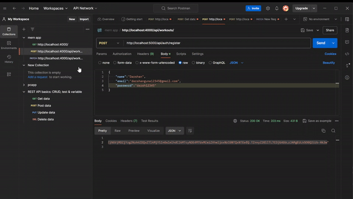

# Quizer - Quiz App

## Description
An interactive quiz application where users can answer multiple-choice questions and receive instant feedback. The app is designed to be engaging and user-friendly, providing a fun way to test knowledge on various topics.

## Features
- **Multiple-Choice Questions**: Users can select answers from predefined options.
- **Scoring System**: Automatically calculates and displays the user’s score after each quiz.
- **Results Page**: Shows the final score and provides feedback on performance.

## Tech Stack
- **Backend**: Node.js (Express)
  - Handles API requests for quiz data and scoring logic.
  - Manages user sessions and quiz state.
- **Frontend**: HTML, CSS, JavaScript, React
  - Will handle the user interface and interaction.

## Installation

1. **Clone the repository**:
   ```bash
   git clone https://github.com/your-username/interactive-quiz-app.git
2. **Navigate to the project directory**:
    ```bash
    cd quizer\backend
3. **Install Backend dependencies**:
   ```bash
   npm install
4. **Run the Server**:
   ```bash
   npm run dev

## Basic implemention of Backend
